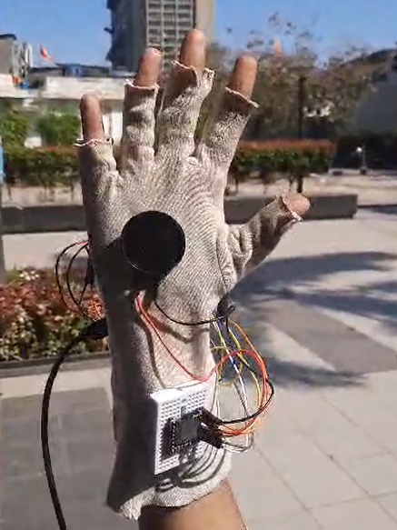
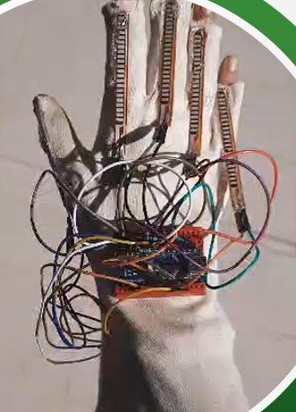
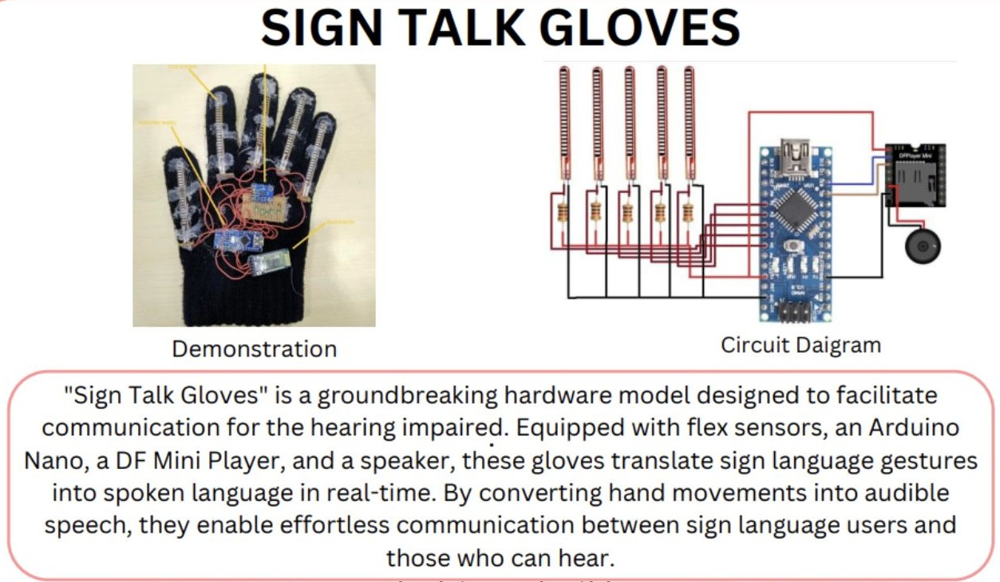

# SignTalk Gloves
SignTalk Gloves is a hardware-based assistive system designed to convert hand gestures into text and speech in real time, enabling communication for speech- and hearing-impaired individuals.

## Overview
The system captures finger movements using flex sensors and processes the data to interpret gestures. These gestures are mapped to predefined outputs and converted into speech using an audio module.

## Features
- Captures gesture data using flex sensors  
- Converts hand gestures into text output  
- Real-time text-to-speech communication  
- Portable and assistive communication system  

## System Architecture
- Flex sensors detect finger bending  
- Arduino processes sensor data  
- Gesture patterns are mapped using threshold-based logic  
- DF Mini Player converts output into speech  

## Working Process
1. Flex sensors capture finger movements  
2. Sensor values are read and processed  
3. Threshold-based logic identifies gestures  
4. Gestures are mapped to predefined text  
5. Output is converted into speech using speaker module  

## Components Used
- Flex Sensors  
- Arduino Nano  
- DF Mini Player  
- Speaker Module  
- Connecting Wires  
- Power Supply  

## Tech Stack
- Arduino  
- Python (for logic understanding / testing)

## Project Demonstration

## 🔌 Circuit Diagram

## 🎥 Demo Videos
- [Demo Video 1](signtalkvideo1.mp4)  
- [Demo Video 2](signtalkvideo2.mp4)  

## 📄 Research Work
This project is supported by a detailed research study covering design, methodology, and system implementation.

Key highlights from the research:
- Focus on bridging communication gap between deaf and hearing individuals  
- Use of reusable components for sustainability  
- Real-time gesture recognition and speech conversion system  
- Practical implementation with testing and validation  

## Description
This project demonstrates a real-time assistive communication system that translates hand gestures into speech. It focuses on sensor-based input processing, embedded system integration, and real-time output generation.

## Applications
- Assistive technology for speech- and hearing-impaired individuals  
- Gesture-based communication systems  
- Human-computer interaction  

## Code
Basic implementation for gesture data reading and processing is included in the `code/` folder.

## Learnings
- Gesture data processing using sensors  
- Embedded system design  
- Real-time communication systems  
- Assistive technology development  

## Note
This project focuses on hardware integration and real-time gesture processing using embedded systems.
